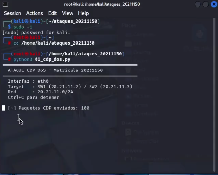
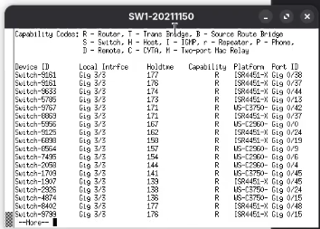
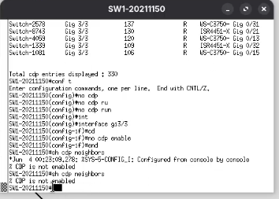

# DoS-mediante-CDP-20211150
# Ataque CDP DoS — Matrícula 20211150
**Autor:** Alvaro Smilk Baez Tavera 
**Matrícula:** 20211150  
**Fecha:** 3 Junio 2026  

---

## Descripción
Script que realiza un ataque DoS mediante el protocolo 
CDP (Cisco Discovery Protocol). Inunda el switch con 
miles de paquetes CDP falsos con Device-IDs y MACs 
aleatorias, agotando la tabla de vecinos CDP y la 
memoria del dispositivo.

---

## Objetivo
Demostrar la vulnerabilidad del protocolo CDP ante 
ataques de inundación en switches Cisco, y aplicar 
las contramedidas necesarias para mitigarlo.

---

## Topología
Router-20211150 (20.21.11.1)
|
SW1-20211150 (20.21.11.2)
|
Kali Linux (20.21.11.50) ← ATACANTE

## Direccionamiento
| Dispositivo | IP           | Interfaz | Rol      |
|-------------|--------------|----------|----------|
| Router      | 20.21.11.1   | gi0/0    | Gateway  |
| SW1         | 20.21.11.2   | gi0/0    | Switch   |
| Kali Linux  | 20.21.11.50  | gi3/3    | Atacante |
| PC1         | DHCP         | gi0/1    | Víctima  |
| PC2         | DHCP         | gi0/2    | Víctima  |
| PC3         | DHCP         | gi0/3    | Víctima  |

---

## Requisitos
- Python 3
- Scapy instalado
- Privilegios root
- Conectividad capa 2 con el switch

### Instalación
```bash
pip3 install scapy --break-system-packages
```

---

## Parámetros del script
| Parámetro | Valor   | Descripción                    |
|-----------|---------|--------------------------------|
| INTERFAZ  | eth0    | Interfaz de red del atacante   |
| DELAY     | 0.05    | Segundos entre paquetes        |
| MAX_PKTS  | 0       | 0 = infinito                   |
| DST MAC   | 01:00:0c:cc:cc:cc | Multicast CDP        |

---

## Uso
```bash
# Básico:
sudo python3 01_cdp_dos.py

# Especificar interfaz:
sudo python3 01_cdp_dos.py eth0

# Limitar paquetes:
sudo python3 01_cdp_dos.py eth0 1000
```

---

## Funcionamiento
1. Genera MAC fuente aleatoria por cada paquete
2. Construye paquete CDP manualmente con TLVs:
   - TLV tipo 1: Device ID aleatorio
   - TLV tipo 2: IP aleatoria
   - TLV tipo 3: Puerto aleatorio
   - TLV tipo 4: Capacidades del dispositivo
   - TLV tipo 5: Versión IOS falsa
   - TLV tipo 6: Plataforma Cisco falsa
3. Calcula checksum CDP real
4. Envía el paquete por la interfaz
5. Repite indefinidamente hasta Ctrl+C

---

## Verificación del ataque
```bash
# En SW1 — ver tabla CDP llenándose:
show cdp neighbors
show cdp neighbors detail
show cdp neighbors | count

# Ver impacto en memoria:
show processes memory sorted | head
```

---

## Capturas

### Durante el ataque


### Tabla CDP llena


---

## Contramedida
```bash
# Deshabilitar CDP globalmente:
SW1(config)# no cdp run

# Deshabilitar por interfaz:
SW1(config-if)# no cdp enable

# Verificar:
SW1# show cdp neighbors
% CDP is not enabled
```

### Verificación contramedida


---

## Video
[Ver demostración en YouTube](https://youtu.be/UhcKSz6EFfU?si=CbJAr2TwJT6YnPz2)

---

## Referencias
- CVE relacionados: CDP vulnerabilities
- Cisco Security Advisory: CDP DoS
- Herramienta: Python 3 + Scapy
